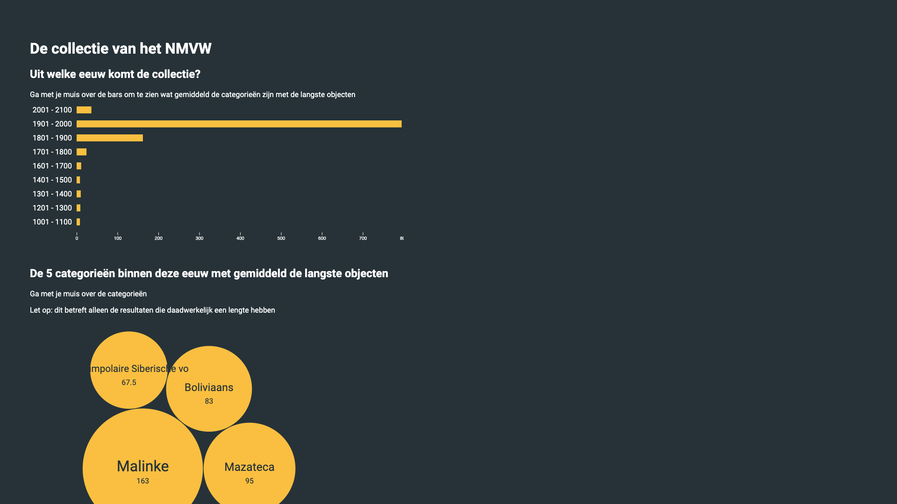

# NMVW collection visualization [](https://app.netlify.com/sites/functional-programming-kris-kuiper/deploys)
> A D3js based data visualization showing the NMVW collection sorted per century, also showes the most popular cultural origins in the century



## Installation
Before installing the project for local development purposes you should have some sort of live server configured. In the future I will include `sirv-cli` to spin up a local dev server. For now I personally use the Live server extension for VSCode. Further steps are included below:

```bash
# 1. Clone this repo
git clone

# 2. Install dependencies
npm install

# 3. Build for production
npm run build
```

## Deploying to production
Continuous Deployment is set up using Netlify. Netlify runs `npm run build` and serves out the `build` folder. You can see how the build script works by looking into `package.json`.

## Data flow
Query, raw data, link to cleaning pattern, new data, little sketch of transformers, formatters etc?

Data is being pulled from the NVMW database, which is a SQL database, queries are built in SPARQL, get encoded as a querystring and added to a queryparam `?query=my-encoded-query`. The raw SPARQL query to get the data looks like this:

```SQL
PREFIX rdf: <http://www.w3.org/1999/02/22-rdf-syntax-ns#>
PREFIX dc: <http://purl.org/dc/elements/1.1/>
PREFIX dct: <http://purl.org/dc/terms/>
PREFIX skos: <http://www.w3.org/2004/02/skos/core#>
PREFIX edm: <http://www.europeana.eu/schemas/edm/>
PREFIX foaf: <http://xmlns.com/foaf/0.1/>

SELECT ?obj ?title (SAMPLE(?img) AS ?img) ?year (SAMPLE(?size) AS ?size) ?subject ?subjectLabel WHERE {
	?sub dc:type ?obj .
	?sub dc:title ?title .
	?sub edm:isShownBy ?img .
	?sub dct:created ?date .
	?sub dct:extent ?size .
	?sub dc:subject ?subject .
	?subject skos:prefLabel ?subjectLabel .
	BIND (xsd:gYear(?date) AS ?year) .
	FILTER (?year > xsd:gYear("1000")) .
} LIMIT 1000
```

I use my [`format-endcoded-endpoint`](https://github.com/kriskuiper/functional-programming/blob/master/src/lib/formatters/format-encoded-endpoint.js) module to generate an endpoint with the stringified query as the queryparam. The `get-clean-data` function does the data fetching and runs the raw data through `clean-data` which gives us back a nicely formatted dataset (see below for more info).

### The raw data
The raw data that comes back from the database looks like this:

```json
{
	"head": { /* Some object */ }
	"results": {
		"bindings": [
			{
        "obj": {
          "type": "literal",
          "value": "foto"
        },
        "title": {
          "type": "literal",
          "xml:lang": "ned",
          "value": "Op jacht"
        },
        "img": {
          "type": "literal",
          "value": "http://collectie.wereldculturen.nl/cc/imageproxy.ashx?server=localhost&port=17581&filename=images/Images/RV//10269-3.jpg"
        },
        "year": {
          "type": "typed-literal",
          "datatype": "http://www.w3.org/2001/XMLSchema#date",
          "value": "1982-01-01"
        },
        "size": {
          "type": "literal",
          "value": "Drager: 16,5 x 21,5 cm\nAfbeelding: 13 x 18 cm"
        },
        "subject": {
          "type": "uri",
          "value": "https://hdl.handle.net/20.500.11840/termmaster2982"
        },
        "subjectLabel": {
          "type": "literal",
          "value": "Tunumiit"
				}
			},
			// More objects
		]
	}
}
```

After the results have gone through my `clean-data` function the data looks a lot cleaner and easier to use:

```json
{
	"1901 - 2000": {
		"results": [
			{
				"title": "Op jacht",
				"img": "http://collectie.wereldculturen.nl/cc/imageproxy.ashx?server=localhost&port=17581&filename=images/Images/RV//10269-3.jpg",
				"size": 13,
				"year": 1982,
				"category": "Tunumiit"
			}
			// More objects
		],
		"emptyResults": [
			{
				"title": "Niet op jacht",
				"img": "http://collectie.wereldculturen.nl/cc/imageproxy.ashx?server=localhost&port=17581&filename=images/Images/RV//10269-3.jpg",
				"size": null,
				"year": 1981,
				"category": "Tunumiit"
			}
		]
	},
	"1801 - 1900": {
		"results": [
			{
				"title": "Awesome title",
				"img": "http://collectie.wereldculturen.nl/cc/imageproxy.ashx?server=localhost&port=17581&filename=images/Images/RV//10269-3.jpg",
				"size": 5.6,
				"year": 1900,
				"category": "Tunumiit"
			}
			// More objects
		],
		"emptyResults": [
			{
				"title": "Another awesome title",
				"img": "http://collectie.wereldculturen.nl/cc/imageproxy.ashx?server=localhost&port=17581&filename=images/Images/RV//10269-3.jpg",
				"size": null,
				"year": 1842,
				"category": "Tunumiit"
			}
			// More objects
		]
	}
}
```

You can read all about how the data cleaning pattern works by going to [the wiki](https://github.com/kriskuiper/functional-programming/wiki/Cleaning-raw-ugly-data)

## Acknowledgements
I certainly want to acknowledge the fact that some people deserve my props, mostly because they've helped me understand D3js. I want to thank the following people for helping me out (props are also given in code comments):

* [Martijn Keesmaat](https://github.com/MartijnKeesmaat) (Thanks for letting me use your barchart as a template for mine)
* [Chazz Mannering](https://github.com/Chazzers) (Thanks for getting me started with using `d3.nest()`)
* [Marc Kunst](https://github.com/MarcKunst) (Thanks for giving me some design feedback and sending me the link to the bubble chart example)
* [Wiebe Kremer](https://github.com/Wiebsonice) (Thanks for adding issues to my repo)
